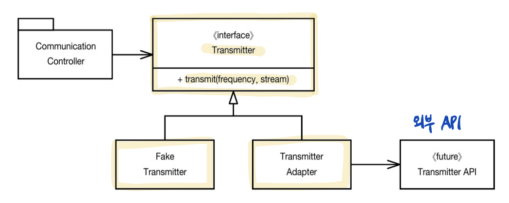

# 8. 경계

생성일: 2022년 2월 10일 오후 1:30

> 우리는 때로 패키지를 사고, 오픈 소스를 이용하며, 다른 팀이 제공하는 컴포넌트를 사용한다. 어떤식으로든 이 외부 코드를 우리 코드에 깔끔하게 통합 해야만 한다.
> 이 장에선 소프트웨어 경계를 깔끔하게 처리하는 기법과 기교를 살핀다.

## 1. 외부 코드 사용하기

- 인터페이스 제공자 와 사용자 사이에는 특유의 긴장이 존재. **패키지 제공자나 프레임워크 제공자**는 적용성을 최대한 넓히려 한다. 반면 **사용자**는 자신의 요구에 집중하는 인터페이스를 바란다. ⇒ 이런 긴장으로 인해 시스템 경계에서 문제가 생길 소지가 많다.
- 한 예로, [java.util.Map](http://java.util.Map) 이 있다. Map이 제공하는 기능성과 유연성은 확실히 유용하지만 그만큼 위험도 크다.
  - 프로그램에서 Map을 여기저기 넘길때, 넘기는 쪽에선 아무도 Map 내용을 삭제하지 않으리라 믿을지도 모르지만 Map사용자라면 누구나 Map내용을 지울 권한이 있다. **⇒ Map이 제공하는 clear() 메서드 이용**
  - 설계 시 Map에 특정 객체 유형만 저장하기로 결정했다 해도, Map은 객체의 유형을 제한하지 않는다. 마음만 먹으면 사용자는 어떤 객체 유형도 추가할 수 있다. **⇒ Map이 제공하는 put(Object key, Object value) 메서드 이용**
- Sensor라는 객체를 담는 Map을 만들때

  ```java
  Map sensors = new HashMap();
  Sensor s = (Sensor)sensors.get(sensorId);
  ```

  - 위 코드가 여러 차례 나온다. Map이 반환하는 Object를 올바른 유형으로 변환할 책임이 Map을 사용하는 클라이언트에 있다.

  ```java
  Map<String, Sensor> sensors = new HashMap();
  Sensor s = sensors.get(sensorId);
  ```

  - 제네릭스(Generics)를 사용하면 코드 가독성이 크게 높아지지만, Map<String, Sensor>가 사용자에게 필요하지 않은 기능까지 제공한다. 인스턴스를 여기저기 넘긴다면, Map 인터페이스가 변할 경우(ex. Key or Value 타입 변경), 수정할 코드가 상당히 많아진다.

  ```java
  // Map을 깔끔하게 사용한 코드
  public class Sensors {
  	private Map sensors = new HashMap();

  	public Sensor getById(String id){
  		  return (Sensor) sensors.get(id);
    }
  }
  ```

  - 경계 인터페이스인 Map을 Sensors 안으로 숨긴다. 따라서 **Map 인터페이스가 변하더라도나머지 프로그램에는 영향을 미치지 않는다.** 제네릭스를 사용하던, 안하던 더 이상 문제가 안된다. Sensors 클래스 안에서 객체 유형을 관리하고 변환하기 때문이다.
  - 또한 Sensors 클래스는 **프로그램에 필요한 인터페이스만 제공한다. 그래서 코드를 이해하기 쉽고 오용하기는 어렵다.** Sensors 클래스는 (나머지 프로그램이) 설계 규칙과 비즈니스 규칙을 따르도록 강제할 수 있다.

- Map을 사용할 때마다 항상 위처럼 캡슐화하란 것이 아니라, Map (혹은 유사한 경계 인터페이스)을 **여기저기 넘기지 말아야 한다.**
- Map과 같은 경계 인터페이스를 이용할 때는 이를 이용하는 클래스나 클래스 계열 밖으로 노출되지 않도록 주의한다. Map인스턴스를 공개 API의 인수로 넘기거나 반환값으로 사용하지 않는다.

## 2. 경계 살피고 익히기

- 외부에서 가져온 패키지를 사용하고 싶다면 어디서 어떻게 시작해야 좋을까? 우리 자신을 위해 **우리가 사용할 코드를 테스트**하는 편이 바람직하다.
- 외부 코드는 익히기 어렵고, 통합하기도 어렵다. 곧바로 코드를 작성해 외부 코드를 호출하는 대신 먼저 간단한 테스트 케이스를 작성해 외부 코드를 익히면 어떻까? 짐 뉴커크는 이를 **‘학습테스트’**라 부른다.
- 학습 테스트는 **프로그램에서 사용하려는 방식대로 외부 API를 호출**한다. 통제된 환경에서 API를 제대로 이해하는지를 확인하는 셈. 학습 테스트는 **API를 사용하려는 목적에 초점**을 맞춘다.

## 3. log4j 익히기

- 로깅 기능을 직접 구현하는 대신 아파치의 log4j 패키지를 사용한다고 가정할 때 간단한 테스트 케이스를 통해 log4j 작동 방식을 이해한다.

```java
@Test
public void testLogCreate() {
  Logger logger = Logger.getLogger("MyLogger");
  logger.info("hello")
}
// Appender라는 뭔가가 필요하다는 오류가 발생한다.

@Test
public void testLogCreate() {
  Logger logger = Logger.getLogger("MyLogger");
  ConsoleAppender appender = new ConsoleAppender();
  logger.addAppender(appender);
  logger.info("hello")
}
// Appender에 출력 스트림이 없다는 사실을 발견한다.
@Test
public void testLogCreate() {
  Logger logger = Logger.getLogger("MyLogger");
  logger.removeAllAppenders();
  logger.addAppender(new ConsoleAppender(new PatternLayout("%p %t %m%n"), ConsoleAppender.SYSTEM_OUT));
  logger.info("hello")
}
// 이제 정상적으로 "hello"가 들어간 로그 메시지가 콘솔에 찍힌다.
```

- 간단한 콘솔 로거를 초기화하는 방법을 익혔으니, 이제 모든 지식을 독자적인 로거 클래스로 캡슐화한다. 그러면 나머지 프로그램은 log4j 경계 인터페이스를 몰라도 된다.

## 4. 학습 테스트는 공짜 이상이다.

- 비용이 들지 않는다.
- 필요한 지식만 확보하는 손쉬운 방법이며 이해도를 높여주는 정확한 실험이다.
- 투자하는 노력보다 얻는 성과가 크다.
- 패키지의 새 버전이 우리 코드와 호환되지 않으면 학습 테스트가 이 사실을 곧바로 밝혀낸다.
- 실제 코드와 동일한 방식으로 인터페이스를 사용하는 테스트 케이스가 꼭 필요하다. 이런 경계 테스트가 있다면 패키지의 새 버전으로 이전하기 쉬워진다.

## 5. 아직 존재하지 않는 코드를 사용하기

- 경계와 관련해 또 다른 유형은 **아는 코드와 모르는 코드를 분리**하는 경계다. 때론 우리 지식이 경계를 너머 미치지 못하는 코드 영역도 있다.
- 저자의 사례)
  - 무선통신시스템에 들어갈 소프트웨어 개발에 참여했다.
  - 소프트웨어에는 ‘송신기(Transmitter)’라는 하위 시스템이 있었지만 우리는 여기에 대한 지식은 거의 없었다. 송신기 시스템을 책임진 사람들은 인터페이스도 정의하지 못한 상태.
  - 경계 너머의 코드를 전혀 알 수는 없지만, **필요한 경계 인터페이스가 무엇인지**는 알게 되었다. ⇒ 송신기 모듈에게 원하는 기능 : _지정한 주파수를 이용해 이 스트림에서 들어오는 자료를 아날로그 신호로 전송하라._
  - 다른 팀이 아직 API 를 설계하지 않았기에 구체적인 방법은 몰랐다. 구현은 나중으로 미루고, 이쪽 코드를 진행하고자 **자체적으로 인터페이스를 정의**했다.
    
    송신기를 예측하기 위해 Transmitter 라는 자체 인터페이스를 정의
  - Transmitter 인터페이스는 주파수와 자료 스트림을 입력으로 받는다. ⇒ 우리가 바라는(필요로하는 인터페이스.
  - 우리가 바라는 인터페이스를 구현하면 우리가 **인터페이스를 전적으로 통제**할 수 있다. 또한 **코드 가독성도 높아지고 코드 의도도 분명해진다.**
  - 통제하지 못하며 정의되지도 않은 외부 송신기 Api에서 CommunicationController를 분리했다. 우리에게 필요한 인터페이스를 정의했으므로 Contoller 코드는 깨끗했다.
  - 다른 팀에서 송신기 API를 정의한 후에는 Adapter를 구현해 간극을 메웠다. Adapter패턴으로 Api 사용을 캡슐화해 API 가 바뀔 때 수정할 코드를 한곳으로 모았다.
  - 이 같은 설계는 테스트도 편하다. 적절한 FakeTransmitter 클래스를 사용하면 CommunicationController 클래스를 테스트 할 수 있다.
  ## 6. 깨끗한 경계
  - 경계에서는 변경이 많이 벌어질 수 있다. 통제하지 못하는 코드를 사용할 때 너무 많은 투자를 하거나 향후 변경 비용이 지나치게 커지지 않도록 각별히 주의해야한다.
  - 경계에 위치하는 코드는 깔끔히 분리하고, 기대치를 정의하는 테스트 케이스를 작성하라.
  - 통제가 불가능한 외부 패키지에 의존하는 대신 통제가 가능한 우리 코드에 의존하라.
  - 외부 패키지를 호출하는 코드를 가능한 줄여 경계를 관리하자.
    - 위 Map 의 예제 처럼, 새로운 클래스로 경계를 감싸거나, Adapter 패턴을 사용해 우리가 원하는 인터페이스를 패키지가 제공하는 인터페이스로 변환.
      ⇒ 코드 가독성이 높아지며, 경계 인터페이스를 사용하는 일관성도 높아지며, 외부 패키지가 변했을 때 변경할 코드도 줄어든다.
