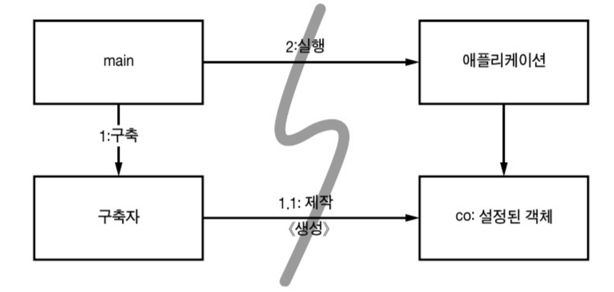
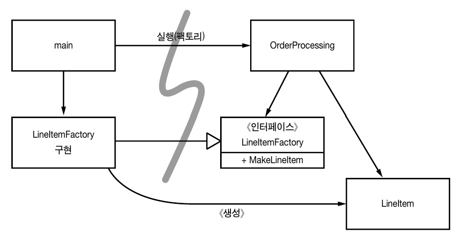
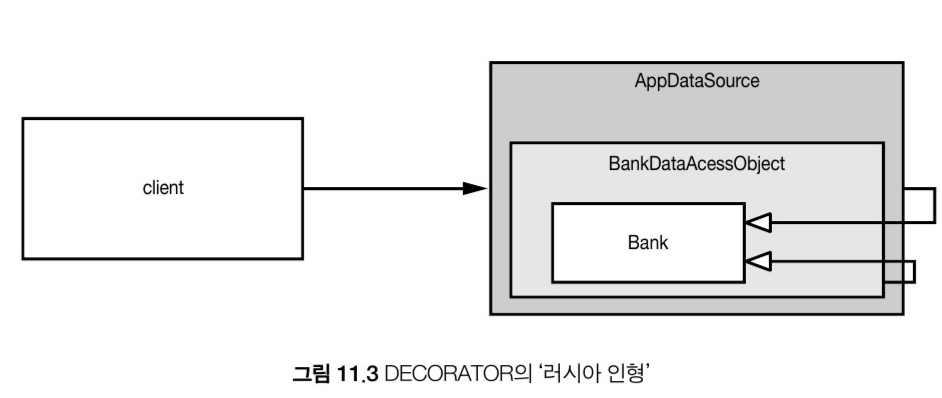

# 11. 시스템

생성일: 2022년 2월 20일 오후 11:18

### 도시를 세운다면?

- 한 사람의 힘으로 도시를 관리하는 것은 불가능 하지만, 수도 관리,전력 관리,교통 관리 팀 등 각 분야를 관리하는 팀이 있어 도시는 잘 돌아간다.
- 적절한 **추상화**와 **모듈화** 때문에 큰 그림을 이해하지 못할지라도 개인과 개인이 관리하는 구성요소는 효율적으로 돌아간다.
- 소프트웨어 팀도 도시처럼 구상한다. 깨끗한 코드를 구현하면 낮은 추상화 수준에서 관심사를 분리하기 쉬워진다.
- 이 장에서는 높은 추상화 수준, 즉 시스템 수준에서 깨끗함을 유지하는 방법을 알아본다.

## 1. 시스템 제작과 시스템 사용을 분리하라.

- 제작(construction)과 사용(use)는 아주 다르다.
- 소프트웨어 시스템은 (애플리케이션 객체를 제작하고 의존성을 서로 연결하는) 준비 과정과 (준비 과정 이후에 이어지는) 런타임 로직을 분리해야한다.
- 이 시작 단계는 모든 애플리케이션이 풀어야 할 관심사다. 관심사 분리는 우리 분야에서 가장 오래되고 가장 중요한 설계 기법 중 하나다.
- 불행히도 대다수 애플리케이션은 시작 단계라는 관심사를 분리하지 않고, 준비 과정 코드를 주먹구구식으로 구현할 뿐만 아니라 런타임 로직과 마구 뒤섞는다.
  ```java
  public Service getService() {
  	if (service == null)
        service = new MyServiceImpl(...); // 모든 상황에 적합한 기본값일까?
  	return service;
  }
  ```
  - 초기화 지연 (Lazy Initialization) 혹은 계산 지연 (Lazy Evaluation) 방식
  - 장점
    - 실제로 필요할 때까지 객체를 만들지 않으므로 불필요한 부하가 걸리지 않는다. 따라서 어플리케이션을 시작하는 시간이 그만큼 빨라진다.
    - 어떤 경우에도 null 포인터를 반환하지 않는다.
  - 단점
    - getService 메서드가 MyServiceImpl에 명시적으로 의존하고 있기 때문에 런타임 로직에서 MyServiceImpl을 전혀 사용하지 않더라도 의존성을 해결하지 않으면 컴파일이 안된다.
    - MyServiceImpl이 무거운 객체라면 단위 테스트에서 getService 메서드를 호출하기 위해 호출하기 적절한 테스트 전용 객체(Test double이나 Mock object)를 service 필드에 할당해야 한다.
    - 일반 런타임 로직에 객체 생성 로직을 섞어놓아서 service가 null인 경로와 null이 아닌 경로 모두 테스트 해야 한다. 즉 메서드의 책임이 둘이기 때문에 단일책임원칙(SRP)를 깬다.
- 체계적이고 탄탄한 시스템을 만들고 싶다면 **설정 논리는 일반 실행 논리와 분리해야 모듈성이 높아진다.** 또한 주요 의존성을 해소하기 위한 방식, 즉 전반적이며 일관적인 방식도 필요하다.

### Main 분리

- 시스템 생성과 시스템 사용을 분리하는 한 가지 방법
- 생성과 관련한 코드는 모두 main이나 main이 호출하는 모듈로 옮기고, 나머지 시스템은 모두 객체가 생성되었고 모든 의존성이 연결되었다고 가정한다.



main()에서 생성 분리

- main 함수에서 시스템에 필요한 객체를 생성한 후 이를 애플리케이션에 넘긴다. 애플리케이션은 그저 객체를 사용할 뿐이다.
- 모든 화살표가 main쪽에서 애플리케이션 쪽을 향한다. 즉 어플리케이션은 main이나 객체가 생성되는 과정은 전혀 모르고 단지 모든 객체가 적절히 생성되었다고 가정한다.

### 팩토리

- 물론 때로는 객체가 생성되는 시점을 어플리케이션이 결정해야할 필요도 생긴다.
- 예를 들어, 주문 처리 시스템에서 어플리케이션은 LineItem 인스턴스를 생성해 Order에 넘긴다. 이때는 Abstract Factory 패턴을 사용한다. 그러면 LineItem을 생성하는 시점은 어플리케이션이 결정하지만 LineItem을 생성하는 코드는 어플리케이션이 모른다.



팩토리로 생성 분리

- 모든 의존성이 main에서 OrderProcessing 애플리케이션으로 향한다. 즉, OrderProcessing 애플리케이션은 LineItem이 생성되는 구체적 방법은 모른다.
- 그 방법 main쪽에 있는 LineItemFactoryImplementation이 안다. 그럼에도 OrderProcessing 어플리케이션은 LineItem 인스턴스가 생성되는 시점을 완벽하게 통제하며, 필요하다면 OrderProcessing 어플리케이션에서 사용하는 생성자 인수도 넘길 수 있다.

### 의존성 주입

- 사용과 제작을 분리하는 강력한 매커니즘 중 하나가 **의존성 주입(Dependency Injection)** 이다. 의존성 주입은 **제어 역전 (Inversion of Control)** 기법을 의존성 관리에 적용한 메커니즘이다.
- 제어 역전에서는 한 객체가 맡은 보조 책임을 새로운 객체에게 전적으로 떠넘긴다. 새로운 객체는 넘겨받은 책임만 맡으므로 **단일 책임 원칙(SRP)**을 지키게 된다.
- 의존성 관리 맥락에서는 객체는 의존성 자체를 인스턴스로 만드는 책임을 지지 않는다. 대신에 이런 책임을 다른 '전담' 메커니즘에 넘겨야 한다. 그렇게 함으로써 제어를 역전한다. 초기 설정은 시스템 전체에서 필요하므로 대개 '책임질' 메커니즘으로 'main' 루틴이나 특수 컨테이너를 사용한다.

## 2. 확장(스케일링)

- 촌락은 마을로, 마을은 도시로 성장한다. 하지만 누가 마을의 성장을 고려해 미리 6차선 고속도로를 지으려 할까? 처음부터 시스템을 제대로 제대로 만든다는 것은 미신일 뿐이다. 우리는 오늘 필요한 것을 만들 뿐이다.
- 내일은 새로운 스토리에 맞춰 시스템을 조정하고 확장하면 된다. 이것이 반복적이고 점진적인 애자일 방식의 핵심이다. 테스트 기반 개발, 리펙토링, 그리고 클린코드가 이를 코드 레벨에서 이를 도와줄 것이다.
- 소프트웨어 시스템은 물리적인 시스템(ex, 건축)과 다르다. 관심사를 적절히 분리해 관리한다면 소프트웨어 아키텍처는 점진적으로 발전할 수 있다.
- 스케일링을 고려하지 않았기에 유기적인 성장이 어려웠던 EJB1/EJB2 아키텍처 예시를 보자.

  - Bank EJB 용 EJB2 지역 인터페이스 (EJB2 local interface for a Bank EJB)

  ```java
  package com.example.banking;
  import java.util.Collections;
  import javax.ejb.*;

  public interface BankLocal extends java.ejb.EJBLocalObject {
      String getStreetAddr1() throws EJBException;
      String getStreetAddr2() throws EJBException;
      String getCity() throws EJBException;
      String getState() throws EJBException;
      String getZipCode() throws EJBException;
      void setStreetAddr1(String street1) throws EJBException;
      void setStreetAddr2(String street2) throws EJBException;
      void setCity(String city) throws EJBException;
      void setState(String state) throws EJBException;
      void setZipCode(String zip) throws EJBException;
      Collection getAccounts() throws EJBException;
      void setAccounts(Collection accounts) throws EJBException;
      void addAccount(AccountDTO accountDTO) throws EJBException;
  }
  ```

  - 상응하는 EJB2 엔티티 빈 구현
    - cf. entity bean이란 관계 데이터(DB 테이블의 행)의 메모리상의 표현

  ```java
  package com.example.banking;
  import java.util.Collections;
  import javax.ejb.*;

  public abstract class Bank implements javax.ejb.EntityBean {
      // Business logic...
      public abstract String getStreetAddr1();
      public abstract String getStreetAddr2();
      public abstract String getCity();
      public abstract String getState();
      public abstract String getZipCode();
      public abstract void setStreetAddr1(String street1);
      public abstract void setStreetAddr2(String street2);
      public abstract void setCity(String city);
      public abstract void setState(String state);
      public abstract void setZipCode(String zip);
      public abstract Collection getAccounts();
      public abstract void setAccounts(Collection accounts);

      public void addAccount(AccountDTO accountDTO) {
          InitialContext context = new InitialContext();
          AccountHomeLocal accountHome = context.lookup("AccountHomeLocal");
          AccountLocal account = accountHome.create(accountDTO);
          Collection accounts = getAccounts();
          accounts.add(account);
      }

      // EJB container logic (EJB 컨테이너 논리)
      public abstract void setId(Integer id);
      public abstract Integer getId();
      public Integer ejbCreate(Integer id) { ... }
      public void ejbPostCreate(Integer id) { ... }

      // The rest had to be implemented but were usually empty: (나머지도 구현해야하나 일반적으로 비어있음)
      public void setEntityContext(EntityContext ctx) {}
      public void unsetEntityContext() {}
      public void ejbActivate() {}
      public void ejbPassivate() {}
      public void ejbLoad() {}
      public void ejbStore() {}
      public void ejbRemove() {}
  }
  ```

위 코드와 같은 전형적인 EJB2 객체 구조는 아래와 같은 문제점을 가지고 있다.

1. 비지니스 로직이 EJB2 컨테이너에 타이트하게 연결되어 있다. Entity를 만들기 위해 컨테이너 타입을 subclass하고 필요한 lifecycle 메서드를 구현해야 한다.
2. 비즈니스 논리가 덩치 큰 컨테이너와 밀접하게 결합되어 독자적인 단위 테스트가 어렵다. 컨테이너를 흉내 내거나 많은 시간을 낭비해 EJB와 테스트를 실제 서버에 배치해야 한다. 그래서 EJB2 코드는 프레임워크 밖에서 재사용하기란 사실상 불가능하다.
3. OOP 개념 조차 뿌리가 흔들린다. 상속도 불가능하며 쓸데없는 DTO(Data Transfer Object)를 작성하게 만든다.

### 횡단(cross-cutting) 관심사

- Cross-Cuttin Concerns란 이론적으로는 독립된 형태로 구분될 수 있지만 실제로는 코드에 산재하기 쉬운 부분들을 뜻한다. ⇒ transaction, authorization, logging 등
- EJB2 아키텍쳐는 시스템의 스케일링을 위한 concern의 분리는 잘 이행하고 있다. 트랜잭션, 보안 , 일부 영속적인 동작은 소스코드가 아닌 배치 기술자 에서 정의한다. 사실 EJB 아키텍처가 영속성, 보안, 트랜잭션을 처리하는 방식은 AOP를 예견했다고 보인다.
- **AOP(aspect-oriented programming, 관점지향프로그래밍)**은 **횡단 관심사에 대처해 모듈성을 확보**하는 일반적인 방법론이다.
- AOP에서 관점(Aspect)라는 모듈 구성 개념은 ‘특정 관심사를 지원하려면 시스템에서 특정 지점들이 동작하는 방식을 일관성 있게 바꿔야 한다’라고 명시한다.

→ 자바에서 사용하는 **_관심사 분리 메커니즘 3가지_**를 살펴보자.

## 3-1. 자바 프록시

- 단순환 상황에 적합하다. 개별 객체나 클래스에서 메서드 호출을 감싸는 경우가 좋은 예다.
- 하지만 JDK에서 제공하는 동적 프록시는 인터페이스만 지원한다. (클래스 프록시 지원을 원하면 외부 바이트 코드 처리 라이브러리 필요)
- Bank 애플리케이션에 JDK 프록시를 사용해 영속성을 지원하는 예제

  ```java
  // Bank.java
  import java.utils.*;

  // 은행 추상화
  public interface Bank {
      Collection<Account> getAccounts();
      void setAccounts(Collection<Account> accounts);
  }

  // BankImpl.java
  import java.utils.*;

  // 추상화를 구현하는 POJO (Plain Old Java Object)
  public class BankImpl implements Bank {
      private List<Account> accounts;

      public Collection<Account> getAccounts() {
          return accounts;
      }

      public void setAccounts(Collection<Account> accounts) {
          this.accounts = new ArrayList<Account>();
          for (Account account: accounts) {
              this.accounts.add(account);
          }
      }
  }

  // BankProxyHandler.java
  import java.lang.reflect.*;
  import java.util.*;

  // “InvocationHandler” required by the proxy API.(프록시 API가 필요한 InvocationHandler
  public class BankProxyHandler implements InvocationHandler {
      private Bank bank;

      public BankHandler (Bank bank) {
          this.bank = bank;
      }

      // Method defined in InvocationHandler
      public Object invoke(Object proxy, Method method, Object[] args) throws Throwable {
          String methodName = method.getName();
          if (methodName.equals("getAccounts")) {
              bank.setAccounts(getAccountsFromDatabase());

              return bank.getAccounts();
          } else if (methodName.equals("setAccounts")) {
              bank.setAccounts((Collection<Account>) args[0]);
              setAccountsToDatabase(bank.getAccounts());

              return null;
          } else {
              ...
          }
      }

      // Lots of details here:
      protected Collection<Account> getAccountsFromDatabase() { ... }
      protected void setAccountsToDatabase(Collection<Account> accounts) { ... }
  }

  // Somewhere else... 다른 곳에 위치하는 코드
  Bank bank = (Bank) Proxy.newProxyInstance(
      Bank.class.getClassLoader(),
      new Class[] { Bank.class },
      new BankProxyHandler(new BankImpl())
  );
  ```

- 프록시 API에는 InvocationHandler 를 넘겨 줘야한다. 넘긴 InvocationHandler 는 프록시에 호출되는 Bank 메서드를 구현하는 데 사용된다.
- 프록시 단점
  - 코드가 많고 복잡하다 → 깨끗한 코드를 작성하기 어렵다.
  - (진정한 AOP 해법에 필요한) 시스템 단위로 실행 ‘지점’을 명시하는 메커니즘도 제공하지 않는다.

## 3-2. 순수 자바 AOP 프레임워크

- 다행히 대부분의 프록시 코드는 판박이라 도구로 자동화 가능하며 순수 자바 관점을 구현하는 Spring AOP 등과 같은 여러 자바 프레임워크는 내부적으로 프록시를 사용한다.
- Spring은 비즈니스 논리를 POJO로 구현했다. POJO는 순수하게 도메인에 초점을 맞추어 다른 프레임워크에 의존하지 않아 테스트하기 쉽고 간단하다.
- 프로그래머는 설정 파일이나 API를 사용해 필수적인 애플리케이션 기반 구조를 구현한다. 여기엔 영속성, 트랜잭션, 보안, 캐시 등과 같은 횡단 관심사도 포함된다.
- 프레임워크는 사용자가 모르게 프록시나 바이트코드 라이브러리를 사용해 이를 구현한다. 이런 선언들이 요청에 따라 주요 객체를 생성하고 서로 연결하는 등 DI 컨테이너의 구체적 동작을 제어한다.
- 아래 예시를 통해 Spring 프레임워크의 동작 방식에 대해 확인해 보자.

```xml
<!-- 스프링 2.X 설정 파일 -->
<beans>
    ...
    <bean id="appDataSource"
        class="org.apache.commons.dbcp.BasicDataSource"
        destroy-method="close"
        p:driverClassName="com.mysql.jdbc.Driver"
        p:url="jdbc:mysql://localhost:3306/mydb"
        p:username="me"/>

    <bean id="bankDataAccessObject"
        class="com.example.banking.persistence.BankDataAccessObject"
        p:dataSource-ref="appDataSource"/>

    <bean id="bank"
        class="com.example.banking.model.Bank"
        p:dataAccessObject-ref="bankDataAccessObject"/>
    ...
</beans>
```



- Bank객체는 BankDataAccessObject가, BankDataAccessObject는 BankDataSource가 감싸 프록시하는 구조로 되어 각각의 bean들이 러시안 인형의 한 부분처럼 구성되었다.
- 클라이언트는 Bank에 접근하고 있다고 생각하지만 사실은 가장 바깥의 BankDataSource에 접근하고 있는 것이다. (Bank POJO의 기본 동작을 확장한 중첩 DECORATOR 객체 집합의 가장 외곽과 통신)
- 애플리케이션에서 DI 컨테이너에게 (xml 파일에 명시된) 시스템 내 최상위 객체를 요청하려면 아래 코드가 필요하다.
  ```java
  XmlBeanFactory bf = new XmlBeanFactory(new ClassPathResource("app.xml", getClass()));
  Bank bank = (Bank) bf.getBean("bank");
  ```
- 구조 정의를 위한 xml은 다소 장황하고 읽기 힘들 수는 있지만, Java Proxy보다는 훨씬 간결하다.
- 이 개념은  `EJB3`의 구조 개편에 큰 영향을 미쳤다. `EJB3`은 xml 설정파일과 와 Java 5 annotation을 사용해 횡단 관심사를 선언적으로 지원하는 스프링 모델을 따른다. 아래와 같이 `EJB2`를 사용하는 코드보다 훨씬 간결하고 결합도가 낮아진 것을 확인 할 수 있다.

  ```java
  package com.example.banking.model;

  import javax.persistence.*;
  import java.util.ArrayList;
  import java.util.Collection;

  @Entity
  @Table(name = "BANKS")
  public class Bank implements java.io.Serializable {
      @Id @GeneratedValue(strategy=GenerationType.AUTO)
      private int id;

      @Embeddable // An object “inlined” in Bank’s DB row
      public class Address {
          protected String streetAddr1;
          protected String streetAddr2;
          protected String city;
          protected String state;
          protected String zipCode;
      }

      @Embedded
      private Address address;
      @OneToMany(cascade = CascadeType.ALL, fetch = FetchType.EAGER, mappedBy="bank")
      private Collection<Account> accounts = new ArrayList<Account>();
      public int getId() {
          return id;
      }

      public void setId(int id) {
          this.id = id;
      }

      public void addAccount(Account account) {
          account.setBank(this);
          accounts.add(account);
      }

      public Collection<Account> getAccounts() {
          return accounts;
      }

      public void setAccounts(Collection<Account> accounts) {
          this.accounts = accounts;
      }
  }
  ```

  - EJB3은 EJB2 보다 훨씬 간결한 코드로 작성할 수 있게 되었다. 몇몇 세부 속성들은 annotation으로 클래스 내에 정의되어 있지만 annotation을 벗어나진 않기 때문에 이전보다 더 깨끗하고 명료한 코드를 산출하며 그로 인해 유지보수, 테스트하기 편한 장점을 갖게 되었다.

## 3-3. **AspectJ**

- 관심사를 관점으로 분리하는 가장 강력한 도구는 AspectJ언어. 언어 차원에서 관점을 모듈화 구성으로 지원하는 자바 언어 확장이다. 8~90%의 경우에는 Spring AOP와 JBoss AOP로도 충분하지만 AspectJ는 훨씬 강력한 수준의 AOP를 지원한다.
- 다만 이를 사용하기 위해 새로운 툴, 언어 구조, 관습적인 코드를 익혀야 한다는 단점도 존재한다.(최근 소개된 "annotation-form AspectJ"로 인해 적용에 필요한 노력은 많이 줄어들었다고 한다.)

## 4. 테스트 주도 시스템 아키텍처 구축

- 애플리케이션 도메인 논리를 POJO로 작성할 수 있다면, 즉 코드 수준에서 아키텍처 관심사를 구분할 수 있다면, 진정한 테스트 주도 아키텍처 구축이 가능하다.
- 그때그때 새로운 기술을 채택해 단순한 아키텍처를 복잡한 아키텍처로 키워갈 수도 있다.
- 소프트웨어 구조가 관점을 효과적으로 분리한다면, 극적인 변화가 경제적으로 가능하다.

<aside>
💡 최선의 시스템 구조는 각기 POJO (또는 다른) 객체로 구현되는 모듈화된 관심사 영역(도메인)으로 구성된다. 이렇게 서로 다른 영역은 해당 영역 코드에 최소한의 영향을 미치는 관점이나 유사한 도구를 사용해 통합한다. 이런 구조 역시 코드와 마찬가지로 테스트 주도 기법을 적용할 수 있다.

</aside>

## 5. **의사 결정을 최적화하라**

- 모듈을 나누고 관심사를 분리하면 지엽적인 관리와 결정이 가능해진다. (한사람이 모든 것을 결정하기는 것은 어렵다.)
- 따라서 가장 적합한 사람에게 책임을 맡기면 가장 좋다.(여기선모듈화된 컴포넌트를 의미) 가장 마지막 순간까지 결정을 미루어 최대한 정보를 모아 최선의 결정을 내리는 것은 때때로 좋은 선택일 수 있다.

<aside>
💡 관심사를 모듈로 분리한 POJO 시스템은 기민함을 제공한다. 이런 기민함 덕택에 최신 정보에 기반해 최선의 시점에 최적의 결정을 내리기가 쉬워진다. 또한 결정의 복잡성도 줄어든다.

</aside>

## 6. 표준을 현명하게 사용하라 (명백한 가치가 있을 때에만)

- 많은 소프트웨어 팀들은 훨씬 가볍고 직관적인 디자인이 가능했음에도 불구하고 그저 표준이라는 이유만으로 EJB2 구조를 사용했다. **표준에 심취해 “고객을 위한 가치 창출”이라는 목표를 잃어 버렸기 때문이다**
- 표준을 사용하면 아이디어와 컴포넌트를 재사용하기 쉽고, 적절한 경험을 가진 사람을 구하기 쉬우며, 좋은 아이디어를 캡슐화 하기 쉽고, 컴포넌트를 엮기 쉽다. 하지만 때로는 표준을 만드는 시간이 너무 오래 걸려 업계가 기다리지 못한다. 어떤 표준은 원래 표준을 제정한 목적을 잊어버리기도 한다.

## 7. 시스템은 도메인 특화 언어가 필요하다

- 도메인 특화 언어 (DSL)을 사용하면 고차원 정책에서 저차원 세부사항에 이르기까지 모든 추상화 수준과 모든 도메인을 POJO로 표현할 수 있다.

## <결론>

- 깨끗하지 못한 시스템 아키텍처는 도메인 논리를 흐리며 기민성을 떨어뜨린다.
- 도메인 로직이 모호해지면 버그는 숨기 쉬워지고 기능 구현은 어려워 진다
- 기민성이 떨어지면 생산성이 낮아지고 TDD로 인한 이득 또한 얻을 수 없다
- 모든 추상화 단계에서 의도는 명확히 표현해야 한다. 그러려면 POJO를 작성하고 관점 혹은 관점과 유사한 메커니즘을 사용해 각 구현 관심사를 분리해야 한다.
- 시스템을 설계하든 개별 모듈을 설계하든, **동작하는 범위에서 가장 간단한 것**을 사용해야 한다는 사실을 명심하자.
